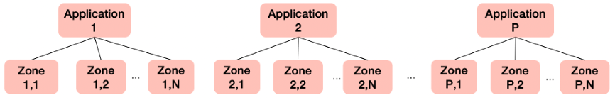
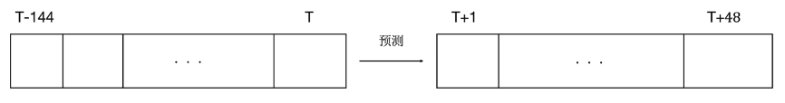

此部分数据为配合Atec绿色计算大赛数据中心流量时序预测同步开源的数据集：

##数据说明
1.提供的数据包括1589条不同应用（Application）的不同区（Zone）的每10分钟采集的流量时序数据。

选手需要利用每个序列的历史数据（过去1天每10分钟流量，共144个点），预测未来8个小时每10分钟流量（共48个点）。

**训练和验证数据集**包括两个月的流量数据，参赛选手按照自身需求划分训练和验证数据集，并训练模型和验证效果。全部数据保存在一个JSON Lines文件中，每一行对应一个item_id时序数据（共1589行），示例如下。
```
{'start': '2022-03-15 00:00:00',
  'end': '2022-05-15 23:50:00',
  'freq': '10min',
  'y': [0.74754228,
  0.78098471,
  0.63987695,
  0.66838659,
  0.58897271,
  ...],
  'app_id': '1',
  'zone_id': '10',
  'item_id': '1'}
```

其中包含以下字段：
- item_id:时序唯一编号,对应一个app下的一个zone
- app_id：时序所属app编号
- zone_id：时序所属zone编号
- start：时序起始时间
- end：时序截止时间
- freq：时序频率，这里为10分钟
- y：流量值。自起始时间（start）到截止时间（end），每10分钟的流量值。选手可以根据起始时间和截止时间以及时序频率，自行推断每一个流量数值的时间点。

文件已经做了压缩处理，可以使用以下解压缩命令进行解压缩：

```
$ cat train.tar.gz*>all.tar.gz
$ tar -zxvf all.tar.gz
```

The data consists of 1589 traffic data collected every 10 minutes for different zones of different applications. Note that each app can have multiple zones. 


The task is to use the historical data of each sequence (zone traffic of every 10 minutes in the past one day, total 144 data points) to predict the following zone traffic of every 10 minutes in the next 8 hours (total 48 data points)


The whole train dataset contains two months of app traffic data,stored in a JSON Lines file. Each line corresponds to a data sample with a unique item_id (1589 lines in total), the example is as follows.
```
{'start': '2022-03-15 00:00:00',
  'end': '2022-05-15 23:50:00',
  'freq': '10min',
  'y': [0.74754228,
  0.78098471,
  0.63987695,
  0.66838659,
  0.58897271,
  ...],
  'app_id': '1',
  'zone_id': '10',
  'item_id': '1'}
```
Each line of data contains the following fields:
- item_id: unique time series id, representing a zone under an app
- app_id: app id of the time series
- zone_id: zone id of the time series
- start: starting time
- end: ending time
- freq: frequency，which is 10 minutes
- y: traffic value time series. The time index can be calculated with the starting time, ending time and frequency.


The files have been compressed to one tar.gz file and can be decompressed using the following command:
```
$ cat train.tar.gz*>all.tar.gz
$ tar -zxvf all.tar.gz
```